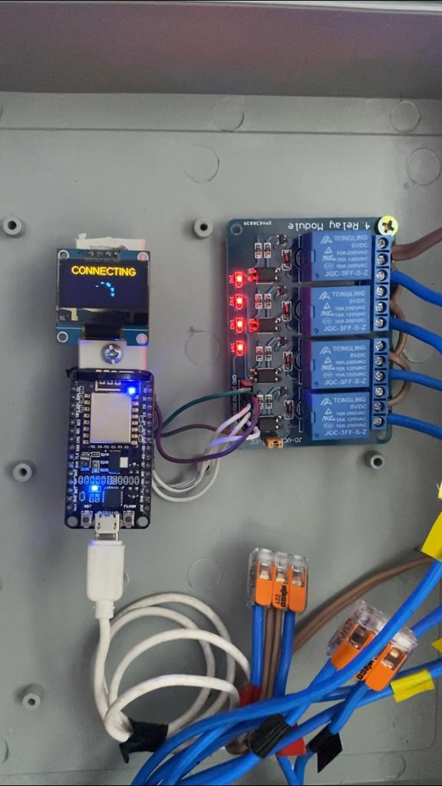

# IOT_esp8266_plugs

## Introdução

<a href="https://www.youtube.com/watch?v=nxtQYYUIfYE" target="_blank"></a>

Esse projeto foi criado para o meu pequeno laboratório com o objetivo 
de controlar quatro tomadas da minha bancada de trabalho. 

Os materiais utilizados:

- [1] Módulo `ESP8266`.
- [2] Módulo com quatro relés.
- [3] Display OLED SD1306

### Ilustração:


<br/>
<hr/>
<br/>

### Informações

<br/>

 O projeto foi escrito no vscode usando o platformio. O ESP8266 se conecta a uma rede wifi local. Você deve especificar o SSID e a senha da sua rede no arquivo `main.cpp`:

```
#define STASSID "YOUR_SSID"
#define STAPSK "YOUR_PASSWORD"
```

Configurei o ESP8266 com ip fixo. Se vc usa sistemas operacionais baseados em unix, conecte-se na sua rede wifi e digite o comando `route` no terminal para saber seu gateway e sua mascara de rede.
Agora configure um ip fixo para o ESP8266 de acordo com as configurações da sua rede editando o arquivo `main.cpp`. Exemplo:

```
IPAddress ip(192, 168, 0, 50);  
IPAddress gateaway(192, 168, 0, 1); 
IPAddress subnet(255, 255, 255, 0); 
```

Edite o arquivo htmlPages.h na liha 164 e informe `ip fixo` configurado. Exemplo:

```
const ip = "192.168.0.50";
```
<br/>

### ROTAS

`http://esp8266_ip/`


A cada 10 segundos é executada no frontend a função verifyStates(). Assim conseguimos através da cor dos botões observar se os estados das GPIOs foram alterados por outro device.

<br/>

### Atualização de firmware via wifi

Selecione o arquivo binário para fazer atualização de firmware.

`http://esp8266_ip/firmware`


<br/>

### Funcionamento da API

O array statePlugs contém os estados das GPIOS:
```
http://esp_ip/states
```


Alteração de estados das GPIOs:
```
Botão 1 --> http://esp8266_ip/toogle?plug=1
Botão 2 --> http://esp8266_ip/toogle?plug=2
Botão 3 --> http://esp8266_ip/toogle?plug=3
Botão 4 --> http://esp8266_ip/toogle?plug=4
```


Os estados da GPIOs são invertidos no ESP8266 `0 para nivel logico alto` e `1 para nivel logico baixo.` Consulte o datasheet. O Front-end recebe a resposta em JSON e de acordo com os valores do array
statePlug a configura a cor dos botões.

Cor cinza (Tomada Desligada)

Cor azul  (Tomada Ligada)

Cor preta quando ocorre falha na conexão ou outro erro. 

### EPROM

Os estados das GPIOS são salvos na EPROM, se o microcontrolador sofrer queda de energia, o ultimo estado
das GPIOs serão restaurados.

<br/>

### Front-end 

 Neste link, eu fiz uma simulação de projeto desse projeto, utilizando javascript, html e css. O Front-end e back-end separados.
 

 https://github.com/tpaphysics/esp8266_simulation 
 
 
 O ideal seria fazer uma aplicação mobile em React Native, por exemplo. Resolvi fazer assim para testar a capacidade do dispositivo o html, css e javascript estão contidos htmlPages.h. Farei um aplicativo mobile em um projeto futuro. Mas essa API consegue interagir facilmente com aplicativos mobile, Alexa, broker MQTT, etc... 

### Animação do display OLED

Brincando com o display oled, resolvi criar uma animação com pontos girando sobre uma circunferência.
Criei primeiramente três pontos com fase de 30° graus entre eles girando com velocidade angular constante sobre uma circunferencia. Não gostei! Então fiz os pontos aumentarem sua velocidade angular até atingir um valor maximo e depois diminuissem até que a velocidade deles fossem nula. 

Ponto 1
```
x(t) = rcos(θ) + 30°
y(t) = rsin(θ) + 30°
```

ponto 2
```
x(θ) = rcos(θ) + 60°
y(θ) = rsin(θ) + 60°
```

ponto 3
```
x(θ) = rcos(θ) + 90°
y(θ) = rsin(θ) + 90°
```

Para pontos que descrevem movimento circular uniforme (velocidade angular constante):

θ = ωt +  θ<sub>0</sub> 
<br/>

θ -> ângulo 
<br/>
ω -> velocidade angular 
<br/>
θ<sub>0</sub> -> fase inicial


Para pontos que descrevem movimento circular acelerado:

θ =  	(1/2)αt² + ω<sub>0</sub>t + θ<sub>0</sub>  
<br/>
θ -> ângulo 
<br/>
α -> aceleração angular 
<br/>
ω -> velocidade angular inicial 
<br/>
θ<sub>0</sub> -> fase inicial

A função do movimento circular acelerado explode nos limites superior e inferior, ou seja, a velocidade angular cresce indefinidamente. Para resolver este problema tive a ideia de construir uma função formada por duas parábolas θ<sub>1</sub> e θ<sub>2</sub> de forma que as derivada θ´<sub>1</sub> e θ´<sub>1</sub> fossem simétricas ao ponto t<sub>m</sub>.

θ<sub>1</sub> = t²
<br/>
θ<sub>2</sub> = - ( t - 2t<sub>m</sub> )² + 2t<sup>2</sup><sub>m</sub>
<br/>
 
### Gráfico da função angular

```
import pylab as plt
import numpy as np


time_max = 2 

x = np.linspace(0, time_max, 256, endpoint=True)
y = x**2

p = np.linspace(time_max, 2*time_max, 256, endpoint=True)
q = -(p-2*time_max)**2 + 2*time_max**2

plt.grid(True)
plt.title("Angle")
plt.xlabel("Time (a.u)")
plt.ylabel("θ")
plt.xlim(0,4)
plt.ylim(0,8)
plt.plot(x,y)
plt.plot(2,4,marker='s', color='red')

plt.legend(['θ1', 'θ2', 'tm=2'], loc=9)
plt.savefig('oled_angle.png')
plt.show()
```


## LICENSE

Licensed under the MIT [licence.](./LICENSE)


